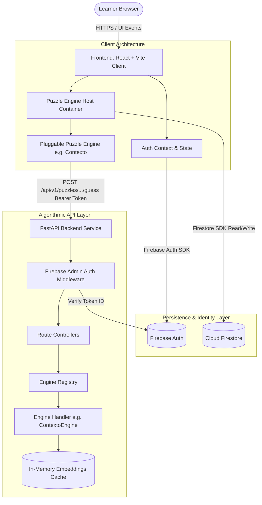
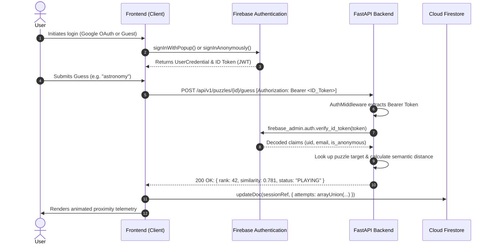

# Adhyayana System Architecture & Topology

> **Status**: Approved System Architecture  
> **Applies to**: Full Monorepo Topology  
> **Version**: 1.0.0  

---

## 1. High-Level Architectural Topology

Adhyayana is designed around a decoupled, three-tier architecture:

1. **Client Tier (`frontend/`)**: React 18 single-page application built with Vite, TypeScript (Strict), and Tailwind CSS.
2. **Algorithmic Evaluation Tier (`backend/`)**: High-performance Python 3.11+ FastAPI service responsible for vector arithmetic, semantic distance scoring, morphological decomposition, and validation.
3. **Identity & Storage Tier (Firebase)**: Firebase Authentication for identity management and Cloud Firestore for document persistence and real-time state synchronization.

---

## 2. Client-Server Boundaries & Responsibilities

| Responsibility Area | Client (`frontend/`) | Server (`backend/`) | Database (`Firestore`) |
| :--- | :--- | :--- | :--- |
| **Authentication UI** | Renders login/guest state, triggers popup/redirect | None (stateless JWT verification) | Stores user profiles |
| **Interactive Gameplay** | State machine (`IDLE` $\rightarrow$ `PLAYING` $\rightarrow$ `WON`), local inputs | None (pure evaluation response) | Persists completed results |
| **Similarity & Distance** | Displays rank progress bar & feedback | Computes cosine similarity, rank index | None |
| **Lexical Validation** | Immediate client format checking | Rigorous dictionary lookup, lemmatization | None |
| **Anti-Cheat Validation** | Obfuscates answer, never knows target | Holds secret solution / embedding target | Holds daily puzzle metadata |
| **Session Tracking** | Optimistic local updates | Validates session token & attempts | Atomic writes to `sessions` |

---

## 3. Authentication & Security Flow

Every request to protected backend endpoints enforces token verification via custom FastAPI dependency injection.

### 3.1 Firebase Admin Verification Middleware
In `backend/app/core/auth.py`, FastAPI exposes a reusable dependency:
- Validates token expiration, issuer (`https://securetoken.google.com/<PROJECT_ID>`), and audience.
- Attaches the decoded `FirebaseUser` payload to `request.state.user`.
- Rejects missing, malformed, or expired tokens with standard 401 `StandardErrorResponse`.

---

## 4. Algorithmic vs Storage Separation

To ensure high responsiveness and horizontal scalability:
1. **The Backend is Stateless**:
   - The FastAPI backend does not store session state in a SQL database. It computes distances and verifies guesses against preloaded memory structures (e.g., semantic vectors, morphological trees).
2. **Firestore Handles Consistency**:
   - Game session checkpoints and user progress are synchronized directly from the client (or via webhook if server-side validation of full session history is mandated).
3. **Zero Secrets in Client**:
   - Target solutions and vector embeddings of upcoming daily puzzles are never transmitted to the client. The client sends a candidate word; the backend returns the rank and relative distance.
